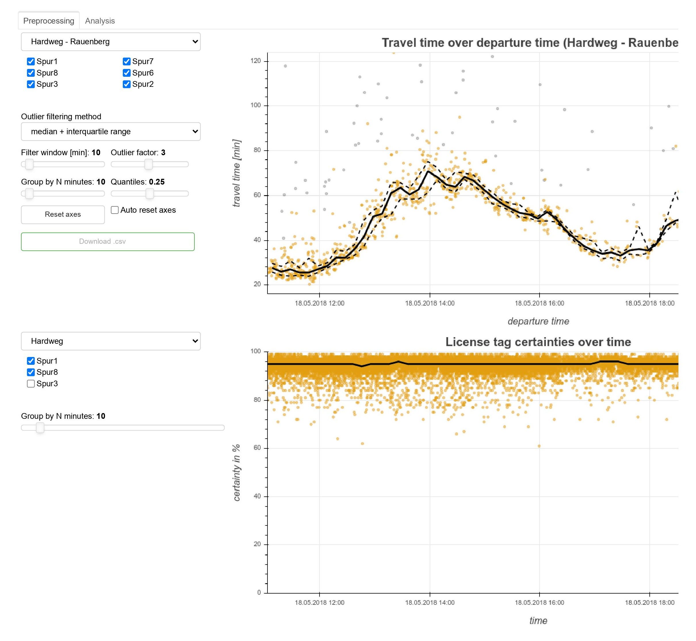

# *Traffic data tools*

### Requirements for the important packages
- Python version      :  3.8.8 
- IPython version     :  7.25.0
- Tornado version     :  6.1
- Bokeh version       :  1.4.0

### Usage
#### Setup
You need to install the packages which are used by the scripts. If you are working on your private computer you can simply install them into your global python environment (which is not recommended).
If you work on the server you first need to setup a [virtualenv](https://docs.python.org/3/library/venv.html).   
You can create a new virtualenv with `virtualenv venv_traffic_data_tools -p python3.8` where `venv_traffic_data_tools` is the name of the virtualenv. If you want to continue workin inside the virutalenv you can activate it with `source venv_traffic_data_tools/bin/activate`. 
After that you should see `(venv_traffic_data_tools)` at the beginning of your terminal text line. This means you are currently using the virtualenv. You can deactivate the virtualenv with `deactivate`. 
You can use `pip install -r requirements.txt` to install all packages you need for the scripts. Keep in mind that you should only install the packages inside the virtualenv. Otherwise your global python environment will be cluttered.

## *license_tags* 
#### Python Script
You first need to run `python main.py` in traffic-data-tools/license_tags
or
`bokeh serve --show main.py` 

## *Radar* 
#### Python Script
You first need to run `python Main.py` in traffic-data-tools/radar/src
or
`bokeh serve --show Main.py` 